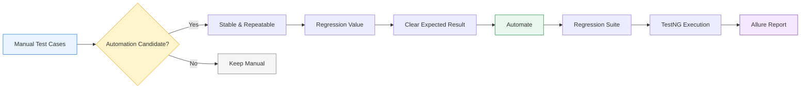
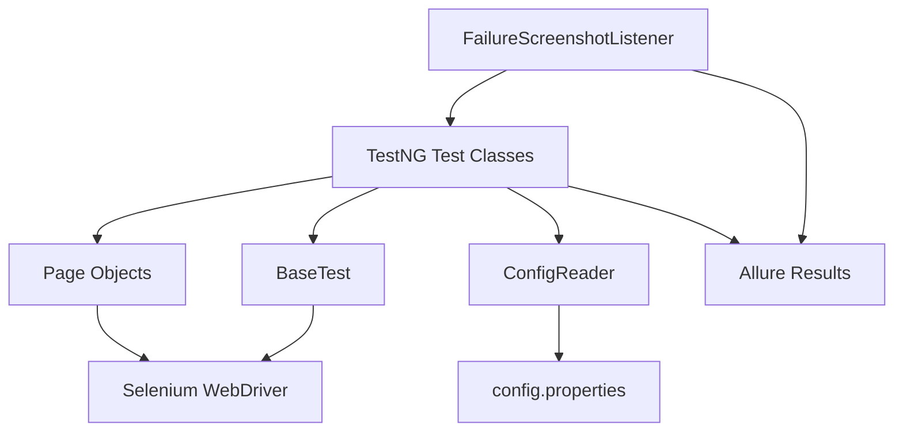

<div align="center">

# QA Automation Framework

### Web UI Test Automation with Selenium, TestNG & Maven


<br/>


</div>

---

## What This Project Demonstrates

This repository demonstrates a practical QA workflow from **manual testing to UI automation**.

The important part is not only writing Selenium code. The repository shows how manual scenarios are reviewed, how automation candidates are selected, how the framework is structured, and how the regression suite is executed and reported.

**Manual testing → automation assessment → reusable framework → regression execution → failure evidence → reporting**

---

## 🔄 Manual Test Cases → Automation Selection



> **Note:** GitHub renders Mermaid diagrams, but it does not support animated Mermaid nodes/edges inside a README. The animated typing workflow above provides the animation, while this Mermaid diagram gives the actual decision flow.

### How were automation candidates selected?

A manual test case was considered for automation when it met several practical criteria:

| Selection factor | Why it matters |
|---|---|
| **Frequently executed** | Reduces repeated manual effort |
| **Regression-focused** | Useful after application changes |
| **Stable functionality** | Less maintenance from changing UI behavior |
| **Clear expected result** | Easy to validate programmatically |
| **High business importance** | Protects important user journeys |
| **Repetitive/data-driven** | Automation handles repeated combinations efficiently |
| **Time-consuming manually** | Provides measurable execution savings |

### What should generally remain manual?

Some scenarios are better suited to manual testing, such as:

- Exploratory testing
- One-time checks
- Rapidly changing functionality
- Subjective visual assessment
- Scenarios requiring human judgment

The goal is **not to automate every manual test case**. The goal is to automate the scenarios where automation provides repeatable regression value.

---

## 🧪 Automated User Journey

```
Manual Test Cases
       │
       ▼
Automation Candidate Review
       │
       ▼
Login
       │
       ▼
Product Listing & Sorting
       │
       ▼
Cart
       │
       ▼
Checkout
       │
       ▼
Order Review
       │
       ▼
Order Placement
       │
       ▼
TestNG Regression Suite
       │
       ▼
Allure Results
```

Current test classes:

- **LoginTest**
- **ProductTest**
- **CartTest**
- **CheckoutTest**
- **CheckoutOverviewTest**

---

## 🏗️ Framework Architecture



### Project Structure

```text
ecommerce-qa-automation/
│
├── src/test/java/
│   ├── base/
│   │   └── BaseTest.java
│   ├── hooks/
│   │   └── FailureScreenshotListener.java
│   ├── pages/
│   │   ├── LoginPage.java
│   │   ├── ProductPage.java
│   │   ├── CartPage.java
│   │   ├── CheckoutPage.java
│   │   └── CheckoutOverviewPage.java
│   ├── tests/
│   │   ├── LoginTest.java
│   │   ├── ProductTest.java
│   │   ├── CartTest.java
│   │   ├── CheckoutTest.java
│   │   └── CheckoutOverviewTest.java
│   └── utils/
│       └── ConfigReader.java
│
├── src/test/resources/
│   └── config/
│       └── config.properties
│
├── pom.xml
└── testng.xml
```

---

## ⚙️ Configuration

Test configuration is maintained in:

**src/test/resources/config/config.properties**

The framework uses the existing properties-based configuration instead of putting environment values directly inside individual test classes.

Typical settings include:

- Application URL
- Browser
- Test credentials
- Environment-level configuration

---

## ▶️ Run the Full Suite

From the automation project directory:

```bash
mvn clean test
```

The TestNG suite is defined in:

**testng.xml**

The suite groups the functional tests into a regression execution.

---

## 📊 Reporting & Failure Evidence

The framework produces Allure-compatible test results.

```bash
allure serve allure-results
```

Failure handling is implemented through:

**FailureScreenshotListener.java**

This provides screenshot evidence when a test fails, making failures easier to investigate.

---

## 📚 Manual QA Documentation

The repository contains the manual QA work that supports the automation process.

| Document | Purpose |
|---|---|
| **Manual Test Cases** | Functional scenarios, test steps, test data and expected results |
| **QA Bug Reports** | Defect documentation and tracking examples |
| **Test Strategy & Automation Observations** | Testing approach and reasoning used to identify automation candidates |
| **Project Observations & Strategy** | Project-level QA observations and testing approach |

### Documentation

- [Manual Test Cases](Manual_Test_Cases.xlsx)
- [QA Bug Reports](QA_Bug_Reports.xlsx)
- [Test Strategy & Automation Observations](QA_Test_Strategy_and_Automation_Observations.xlsx)
- [Test Strategy & Automation Observations - Document](QA_Test_Strategy_and_Automation_Observations.docx)
- [Project Observations & Strategy](QA_Project_Observations_and_Strategy.docx)

---

## 🧩 Framework Design

### Page Object Model

Locators and page actions are kept inside page classes.

Tests therefore describe **what is being verified**, while page classes handle **how the application is interacted with**.

### Reusable Configuration

Environment-specific values are read through:

**ConfigReader → config.properties**

### Separation of Concerns

```
Tests       → What to verify
Pages       → How to interact with the UI
Base        → Driver lifecycle
Hooks       → Test events / failure evidence
Utils       → Reusable support logic
Resources   → Configuration
```

### Maintainability

The framework keeps:

- Locators inside page objects
- Configuration inside properties
- Driver setup inside the base layer
- Failure handling inside listeners
- Verification logic inside test classes

---

## 🛠️ Tech Stack

| Tool | Version / Purpose |
|---|---|
| Java | **21** |
| Selenium WebDriver | 4.35.0 |
| TestNG | 7.11.0 |
| Cucumber | 7.27.2 |
| Allure | 2.29.1 |
| AShot | 1.5.4 |
| Maven | Build & dependency management |

---

## 🎯 Complete QA Workflow

```mermaid
flowchart LR
    A["Requirements"] --> B["Manual Test Design"]
    B --> C["Functional Execution"]
    C --> D["Bug Identification"]
    D --> E["Regression Candidate Selection"]
    E --> F["Automation Feasibility Review"]
    F --> G["Page Object Design"]
    G --> H["Selenium Automation"]
    H --> I["TestNG Regression"]
    I --> J["Failure Evidence"]
    J --> K["Allure Reporting"]
```



---

<div align="center">

### QA Thinking + Automation + Maintainable Framework Design

</div>
