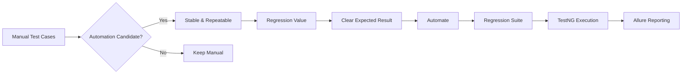
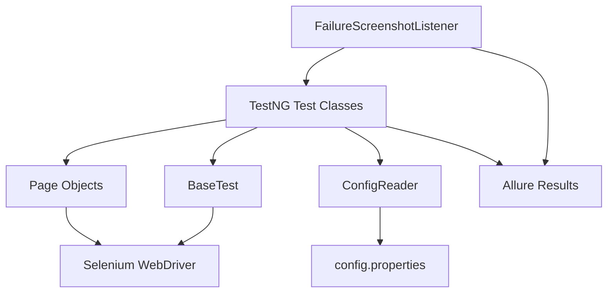

# QA Automation Framework

### Web UI Test Automation with Selenium WebDriver, TestNG & Maven

 

---

## Project Overview

This repository demonstrates an end-to-end **QA testing and UI automation workflow** using a maintainable Selenium WebDriver framework.

The project covers:

**Manual test design → execution → defect thinking → automation assessment → Page Object Model → TestNG regression → failure evidence → reporting**

The focus is not simply on writing Selenium scripts. It demonstrates the reasoning behind **what should be automated, how automation should be structured, and how the suite can be executed repeatedly with minimal maintenance**.

---

## What This Project Demonstrates

- Functional test case design
- Automation candidate assessment
- Positive and negative testing
- Regression-focused UI automation
- Selenium WebDriver with Java
- Page Object Model (POM)
- Reusable configuration through properties
- Explicit waits for synchronization
- TestNG suite management
- Failure screenshot capture
- Allure-compatible reporting
- Maven build and test execution
- CI-ready project structure
- Separation of test, page, configuration, and framework responsibilities

---

## Manual Testing → Automation Assessment

> GitHub supports Mermaid rendering in README files, but Mermaid nodes and connectors are not animated there. The animated typing header above provides visual motion while the Mermaid diagram communicates the actual QA decision flow.

### Automation Candidate Criteria

A manual scenario is a strong automation candidate when it is:

| Criterion | Automation value |
|---|---|
| Frequently executed | Reduces repeated manual effort |
| Regression-focused | Reusable after application changes |
| Stable | Lower maintenance overhead |
| Deterministic | Produces a clear expected result |
| Business-critical | Protects important user journeys |
| Repetitive | Automation executes repeated actions consistently |
| Time-consuming manually | Creates meaningful execution savings |

### Scenarios Better Suited to Manual Testing

Not every test should be automated. Examples include:

- Exploratory testing
- One-time validation
- Rapidly changing functionality
- Subjective visual assessment
- Usability observations
- Scenarios requiring human judgment

**Automation objective:** automate where repeatability and regression value justify the maintenance cost.

---

## Automated Functional Coverage

The current suite contains **27 TestNG test methods** across five functional areas.

| Test Class | Coverage |
|---|---|
| `LoginTest` | Valid login, invalid credentials, required-field validation, locked account |
| `ProductTest` | Product visibility, product details, name sorting, price sorting |
| `CartTest` | Add, remove, badge count, multiple-item behavior |
| `CheckoutTest` | Checkout navigation, valid information, required-field validation |
| `CheckoutOverviewTest` | Product summary, subtotal, tax, total, order placement, return navigation |

### Primary User Journey

~~~text
Login
  ↓
Product Listing
  ↓
Product Details / Sorting
  ↓
Cart
  ↓
Checkout
  ↓
Order Review
  ↓
Order Placement
  ↓
Confirmation
~~~

---

## Framework Architecture

### Separation of Responsibilities

~~~text
Tests        → What to verify
Pages        → How to interact with the UI
BaseTest     → Driver lifecycle and shared setup
Hooks        → Test events and failure evidence
Utils        → Reusable framework support
Resources    → Environment and test configuration
~~~

---

## Project Structure

~~~text
qa-automation-framework/
│
├── .github/
│   └── workflows/
│       └── maven-ci.yml
│
├── docs/
│   ├── defects/
│   │   └── QA_Bug_Reports.xlsx
│   ├── manual/
│   │   └── Manual_Test_Cases.xlsx
│   └── strategy/
│       ├── QA_Project_Observations_and_Strategy.docx
│       ├── QA_Test_Strategy_and_Automation_Observations.docx
│       └── QA_Test_Strategy_and_Automation_Observations.xlsx
│
├── src/
│   └── test/
│       ├── java/
│       │   ├── base/
│       │   │   └── BaseTest.java
│       │   ├── hooks/
│       │   │   └── FailureScreenshotListener.java
│       │   ├── pages/
│       │   │   ├── LoginPage.java
│       │   │   ├── ProductPage.java
│       │   │   ├── CartPage.java
│       │   │   ├── CheckoutPage.java
│       │   │   └── CheckoutOverviewPage.java
│       │   ├── tests/
│       │   │   ├── LoginTest.java
│       │   │   ├── ProductTest.java
│       │   │   ├── CartTest.java
│       │   │   ├── CheckoutTest.java
│       │   │   └── CheckoutOverviewTest.java
│       │   └── utils/
│       │       └── ConfigReader.java
│       │
│       └── resources/
│           └── config/
│               └── config.properties
│
├── .gitignore
├── LICENSE
├── pom.xml
├── README.md
└── testng.xml
~~~

---

## Configuration

All environment and test configuration is centralized in:

`src/test/resources/config/config.properties`

~~~properties
browser=chrome
headless=false
url=https://www.saucedemo.com/

standard.username=standard_user
standard.password=secret_sauce

invalid.username=invalid_user
invalid.password=invalid_password
locked.username=locked_out_user

test.firstName=John
test.lastName=Doe
test.postalCode=500001
~~~

### Why properties-based configuration?

It keeps environment and test data outside the test implementation.

~~~text
Test Class
    ↓
ConfigReader
    ↓
config.properties
~~~

---

## Run the Test Suite

### Prerequisites

- Java 21+
- Maven 3.x
- Google Chrome
- Internet connection for the application under test and Maven dependencies

Selenium 4 uses Selenium Manager for driver management, so a separate ChromeDriver executable is not required.

### Run the complete regression suite

~~~bash
mvn clean test
~~~

### Run in headless mode

~~~bash
mvn clean test -Dheadless=true
~~~

The Maven Surefire plugin is configured to execute:

`testng.xml`

---

## Reporting & Failure Evidence

The framework integrates with **Allure** and captures screenshots through a TestNG listener.

### Failure handling

~~~text
Test Execution
      ↓
TestNG Listener
      ↓
Test Result
      ↓
Screenshot Capture
      ↓
Allure Attachment
~~~

The listener:

`src/test/java/hooks/FailureScreenshotListener.java`

captures browser screenshots when tests fail and attaches them to Allure results.

### View Allure results

~~~bash
mvn allure:serve
~~~

Or, if Allure CLI is installed:

~~~bash
allure serve target/allure-results
~~~

Generated output is intentionally excluded from Git using `.gitignore`.

---

## Framework Design

### Page Object Model

Each application page owns its:

- Locators
- UI actions
- Page-specific synchronization

Tests focus on business verification rather than low-level Selenium operations.

### Explicit Waits

The framework uses `WebDriverWait` and `ExpectedConditions` where synchronization is required.

This avoids relying on arbitrary hard-coded sleeps.

### Reusable Driver Setup

`BaseTest` manages:

- Configuration loading
- Browser initialization
- Headless execution
- Application navigation
- Driver cleanup

### Failure Evidence

`FailureScreenshotListener` centralizes screenshot capture instead of duplicating screenshot logic across test methods.

---

## QA Documentation

The repository includes supporting QA artifacts demonstrating the work that leads to automation.

| Artifact | Purpose |
|---|---|
| [Manual Test Cases](docs/manual/Manual_Test_Cases.xlsx) | Functional scenarios, steps, data and expected results |
| [QA Bug Reports](docs/defects/QA_Bug_Reports.xlsx) | Defect documentation examples |
| [Test Strategy & Automation Observations](docs/strategy/QA_Test_Strategy_and_Automation_Observations.xlsx) | Automation assessment and testing observations |
| [Test Strategy Document](docs/strategy/QA_Test_Strategy_and_Automation_Observations.docx) | Detailed QA strategy documentation |
| [Project Observations & Strategy](docs/strategy/QA_Project_Observations_and_Strategy.docx) | Project-level testing observations |

---

## Technology Stack

| Technology | Version / Role |
|---|---|
| Java | 21 |
| Selenium WebDriver | 4.35.0 |
| TestNG | 7.11.0 |
| Allure TestNG | 2.29.1 |
| Maven | Build & dependency management |
| GitHub Actions | CI |
| Page Object Model | Framework design pattern |

---

## End-to-End QA Workflow

```mermaid
flowchart LR
    A["Requirements"] --> B["Manual Test Design"]
    B --> C["Functional Execution"]
    C --> D["Defect Identification"]
    D --> E["Regression Candidate Review"]
    E --> F["Automation Feasibility"]
    F --> G["Page Object Design"]
    G --> H["Selenium Automation"]
    H --> I["TestNG Regression"]
    I --> J["Failure Evidence"]
    J --> K["Allure Reporting"]
```

---

## Engineering Quality Checklist

- [x] Page Object Model
- [x] Reusable configuration
- [x] Explicit waits
- [x] Centralized driver lifecycle
- [x] TestNG suite configuration
- [x] Failure screenshot listener
- [x] Allure-compatible results
- [x] Maven build configuration
- [x] CI workflow
- [x] Generated artifacts excluded from source control
- [x] QA documentation included
- [x] Manual-to-automation reasoning documented

---

## Future Enhancements

- Cross-browser execution
- Data-driven testing with TestNG `@DataProvider`
- Environment profiles
- Parallel execution
- API test layer
- Smoke and regression suite groups
- Advanced Allure metadata
- CI artifact publishing
- Dependency/security automation

---

### QA Thinking • Reliable Automation • Maintainable Framework Design

